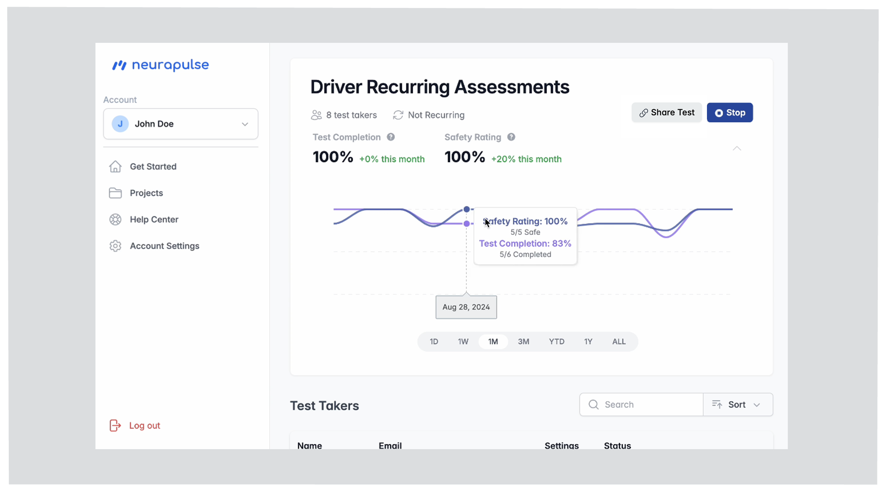
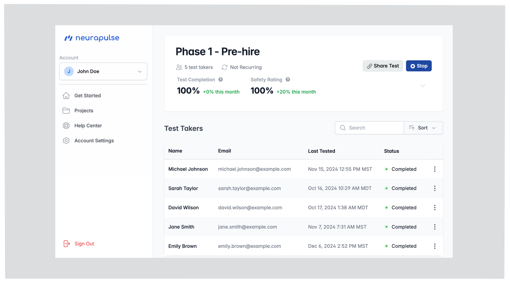

The Neurapulse portal is your central hub for managing tests.

### Main Navigation

- **Projects:** Create and manage assessment projects
- **Help Center:** Access documentation and support
- **Account Settings:** Update your information and preferences, including billing

### Dashboard Features

- **View Top Priorities:** Review your top priorities, like test takers that are high risk
- **Safety Metrics:** Monitor overall cognitive safety trends

// Removed heroicons import (Mintlify restricts imports)

## Key Metrics

- Safety Rating
- Test Completion Rate

## Test Taker Table

- See test taker status sorted by priority
- Watch updates in realtime as test takers complete their test.

