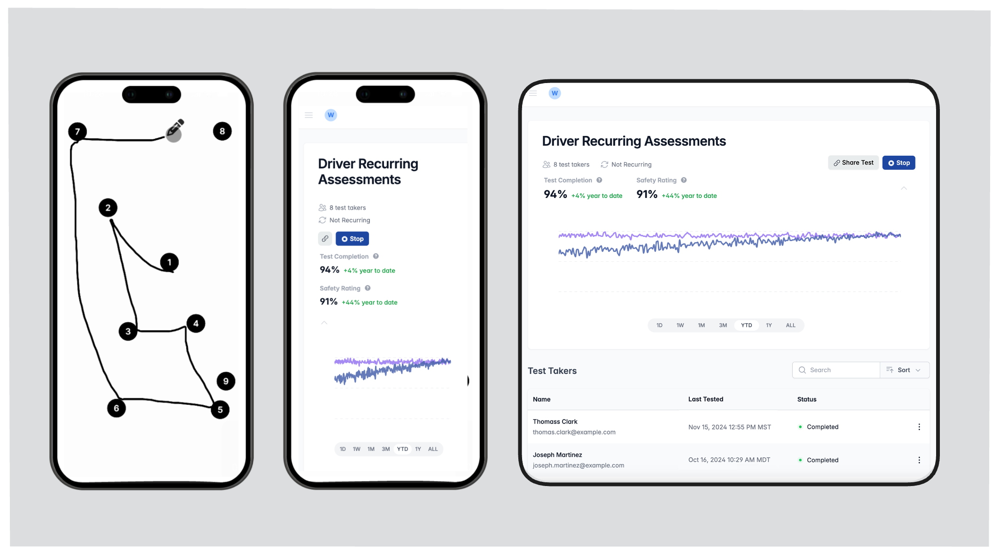

# Need Help?

Have questions about your [test taker experience](../Test-Taker-Experience/test-taker-journey) or how to [send your first test](../Projects/creating-a-project)? If you are a test taker and have questions about why you are being tested, please reach out to your organization directly.

# Introduction to Neurapulse

Neurapulse is a cognitive assessment platform that measures impairment risk in workplace settings. Our solution helps organizations maintain safety standards and optimize team performance.

## Key Applications

- **Hiring:** Evaluate candidate cognitive functions during recruitment
- **Fleet Management:** Monitor driver cognitive fitness
- **Construction:** Assess worker readiness for machinery operation
- **Small Businesses:** Implement cognitive safety protocols

## Core Benefits

### Rapid Cognitive Assessment

- Complete tests in under 5 minutes
- Identify risk of impairment before work begins

### Real-Time Safety Insights

- Receive immediate, data-driven feedback on team safety via the Neurapulse portal
- Make fast decisions on worker fitness for duty

### Integration

- Incorporate into existing safety protocols
- Customize testing frequency for your specific workplace needs

### Secure Identity Verification

- Ensure test accuracy and privacy

### Easy to Scale

- Deploy tests frequently, with no app download required for test takers
- Offer self-enrollment via links or QR codes

<Note>
  This documentation guides you through using Neurapulse, from account setup to
  result interpretation and best practices.
</Note>

## Next Steps

1. [Sign up for an account](../Getting-Started/signing-up)
2. [Create your first project](../Projects/creating-a-project)
3. [Run your first assessment](../Projects/running-tests)
