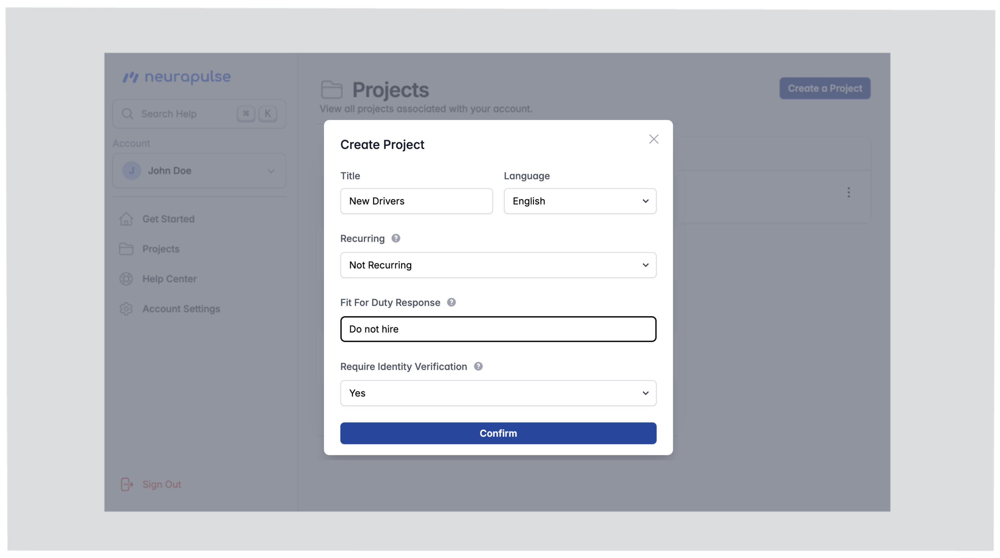

1. Click on "Projects" in the navigation menu.
2. Click "Create a Project".

 3. Complete the setup:

- **Name:** Choose a descriptive project title.
- **Language:** Select the primary language for assessments.
- **Recurring Status:**
  - Non-Recurring: One-time assessment (default).
- **Fit For Duty Response:** Define actions for high-risk results. For example, you can write 'Interview the test taker', or enter a URL.
- **Require Identity Verification:** Require test takers to verify their identity before taking the test, using an id card and selfie.

 4. Review your entries and click "Confirm". You will be redirected to the project's dashboard.

<Note>
  You can navigate to your project's dashboard by clicking on the project's name
  from the list (see below).
</Note>

<Warning>
  Set a clear "Fit For Duty Response" to guide actions for high-risk results.
</Warning>
