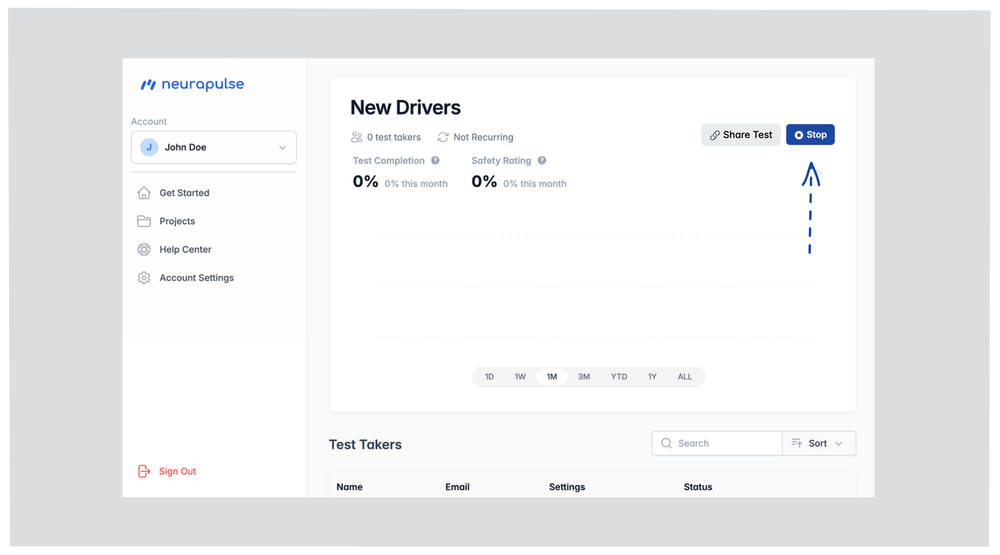

### Activating a Project

1. Open the project dashboard (by selecting it from the Projects page)
2. Click the "Run" button to enable test takers to take tests
   
3. The project is now in a running state, and anyone can use the shareable test link
   

### Stopping a Project

1. Click the "Stop" button on a running project to prevent new and existing test takers from using a test link
   
2. Click to confirm to verify the change
   

### Sharing Test Links

#### Self-Enrollment Link

1. Click "Share Link" button
   
2. Share the link or QR Code to allow test takers to self-enroll
   

<Note>
  Test takers can scan the QR code to access a test in the same way a link is
  clicked. To share this QR code, you can right click it and save the image to
  your computer. This allows you to attach it to emails, text messages, or other
  communications.
</Note>

<Info>
  If a test taker does not receive a confirmation code when they are self
  enrolling for a test, encourage them to check their junk email folder.
</Info>

### Managing Test Access

- **Active Projects:** Test links are valid when the project is running
- **Inactive Projects:** Test links are disabled when the project is stopped

To pause testing, click "Stop" on the project dashboard. This will temporary lock out test takers from running tests from the test link or scanned QR Code.
