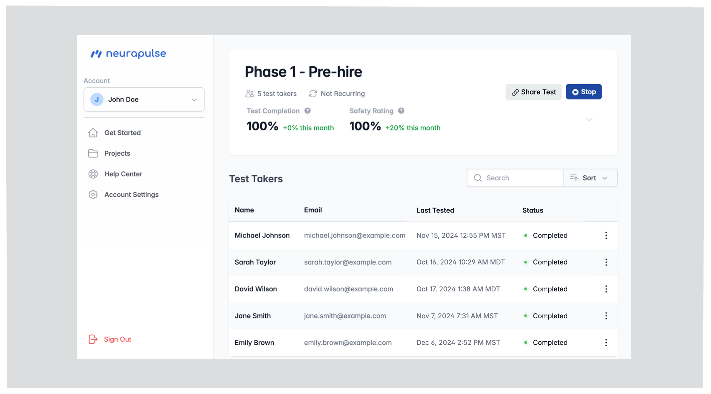
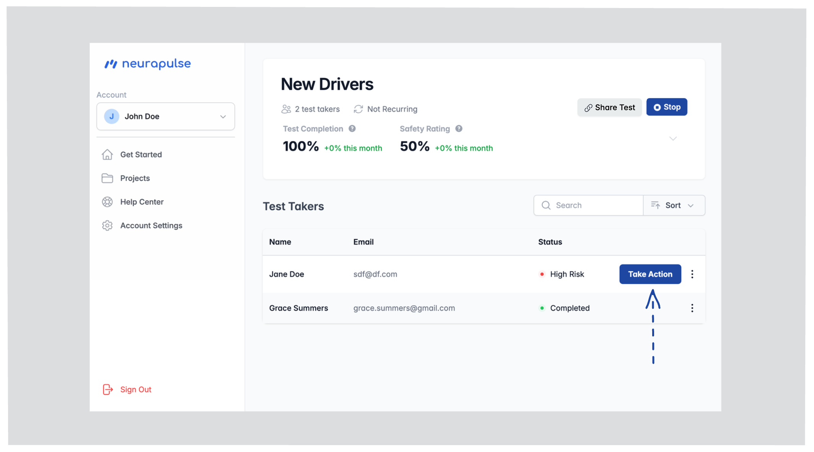
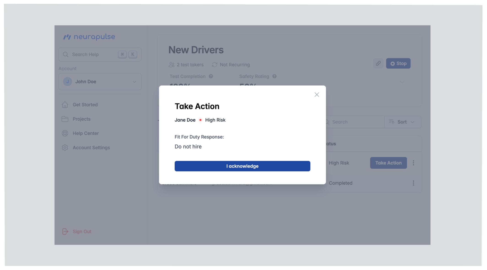
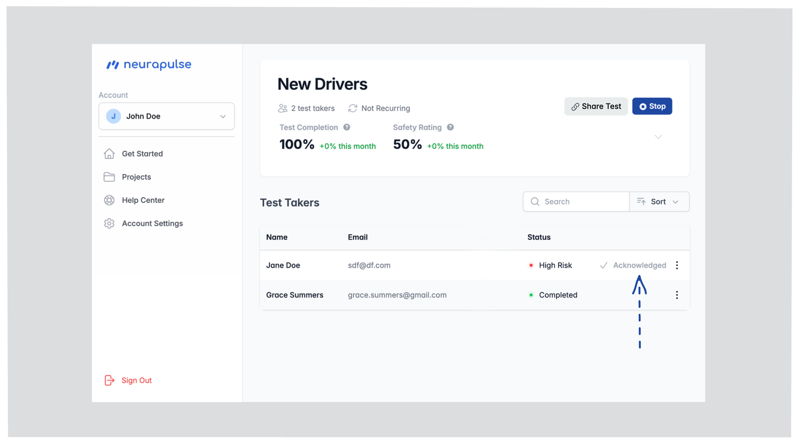
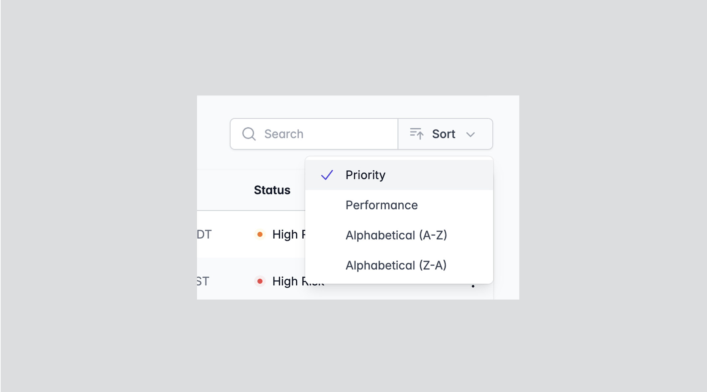

# Viewing and Interpreting Results

As a test manager, keep these things in mind when monitoring a project:

- **Statuses Are Prioritized:** Results are displayed in descending order of importance, allowing you to focus on critical issues first.
- **High Risk Requires Action:** When setting up a project, set a reasonable "Fit For Duty Response" for addressing high risk cases. You can write a simple policy such as "Interview the test taker" or add a link to a shared document containing a longer policy (e.g. https://example.com/my-risk-policy).
- **Action Protocol:** If a test taker shows a `Take Action` button, follow the predefined Fit For Duty Response that is shown. This button is only shown in cases with a confirmed and unaddressed high risk.
- **Daily Testing:** If daily testing is enabled for the project, the test taker's status will reflect the most recent test completed.

Let's break down how to access and interpret these safety statuses, and what steps to take for each scenario.

{/* Inline component removed; convert to static list for compatibility */}

## Accessing Results

1. Navigate to "Projects" in the main menu
2. Select the specific project
3. View the list of test takers and their statuses

## Test Taker Status Types

<ul>
  <li>
    <strong>Not Started:</strong> The test taker registered but hasn't begun the
    test.
  </li>
  <li>
    <strong>Active:</strong> The test taker is currently taking the test.
  </li>
  <li>
    <strong>Timed Out:</strong> The test taker did not complete the most recent
    test within 30 minutes of starting.
  </li>
  <li>
    <strong>Completed:</strong> The test finished with no impairment risk
    detected for the test taker.
  </li>
  <li>
    <strong>High Risk:</strong> Risk of impairment was detected. Click the Take
    Action button and perform the predefined Fit For Duty Response shown.
  </li>
  <li>
    <strong>Confirming:</strong> Risk of impairment was detected. Up to 2
    additional attempts are required to confirm the risk.
  </li>
  <li>
    <strong>Unconfirmed:</strong> Risk of impairment was detected, but the test
    taker did not complete a retry attempt within one hour. Their cognitive
    performance could not be determined.
  </li>
</ul>

## Handling High Risk Cases

When a test taker is flagged as high risk:

1. A "Take Action" button appears next to their name

2. Click the button to view your pre-defined "Fit For Duty Response" (set in project's settings)

3. Follow the specified "Fit For Duty Response" protocol
4. Click "I Acknowledge" to confirm you've addressed the situation
5. The test taker's record updates accordingly

<Tip>
  Address high-risk cases promptly according to your organization's protocols.
</Tip>

### Daily Testing

If daily testing is enabled for the project, the test taker's status will reflect the most recent test completed. Check to see if there are any test takers that are delinquent and need to complete a test.

## Sorting Options

When viewing your test results, you can sort the data to better organize and find the information you need. The sort functionality helps you prioritize which test takers to focus on first.

To sort your results:

1. Click the "Sort" dropdown in the upper right corner of the test taker table
2. Select one of the available sorting options:

### Available Sorting Options

- **Priority**: Sorts test takers by status priority, showing high-risk cases first (default)
- **Performance**: Sorts test takers by their test performance. Top performers are shown first.
- **Alphabetical (A-Z)**: Sorts test takers by name in ascending alphabetical order
- **Alphabetical (Z-A)**: Sorts test takers by name in descending alphabetical order

<Tip>
  Use "Priority" sorting to quickly identify test takers who need immediate
  attention, especially in projects with many participants.
</Tip>
